

# Local Arena

[English](README.md) | **简体中文**

 

 
 

[下载已发布版本](https://github.com/numakkiyu/Local-Arena/releases) · [提交问题反馈](https://github.com/numakkiyu/Local-Arena/issues) · [为什么更名](#为什么更名为-local-arena) · [代码来源与署名](#上游代码来源与署名)

> [!IMPORTANT]
> Local Arena 是独立开发和维护的 Windows 工具，用于本地 CS2 对局、玩家饰品、Demo、诊断和受管安装
>
> Local Arena 与 [ed0ard/CS2-Bot-Improver](https://github.com/ed0ard/CS2-Bot-Improver) 及其维护者互不隶属，不代表上游官方，也不由上游维护者提供支持
>
> Local Arena 的构建、面板、安装、匹配、饰品、诊断、闪退或更新问题，请统一在[本仓库 Issues](https://github.com/numakkiyu/Local-Arena/issues) 提交，不要向上游项目反馈 Local Arena 的问题
>
> 部分增强人机组件仍基于上游 AGPL-3.0 代码，其来源和作者署名会继续保留；Local Arena 的开发、发布、问题追踪和用户支持均由本仓库独立负责
>
> 仓库迁移期间，现有安装会暂时保留旧可执行文件名、`.csbip` 数据目录、图标和面板外观，以保证在线更新、备份、预设和比赛记录不丢失

当前 `main` 分支源码版本为 **1.4.2.5**

**教程导航：** [首次安装](#四步完成首次安装) · [已有安装](#更新已有安装) · [启动模式](#选择正确的启动模式) · [玩家饰品](#玩家饰品预设) · [更新恢复](#安装更新与恢复) · [常见问题](#常见问题)

  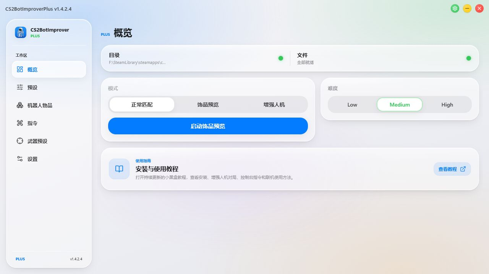

---

## 为什么更名为 Local Arena

项目现已发展为一套独立的本地 CS2 体验，拥有自己的匹配系统、饰品管理、Demo 流程、诊断能力、安装器、发布流程和用户支持责任。**Local Arena** 更能准确表达产品定位，也可以避免用户误以为本项目是由上游维护的官方增强版本。

这次调整只是在品牌和维护边界上进行分离，并不抹去项目的代码来源。源自上游 AGPL-3.0 代码的组件会继续保留作者署名并遵守许可证要求，上游仓库也会继续列在代码来源章节中。Local Arena 特有功能和发行版本的问题应在本仓库反馈，避免让上游维护者处理其并未开发或发布的功能。

## Local Arena 功能

- 玩家刀具、手套和武器皮肤支持 CT 与 T 两套独立预设
- 双方共用武器可以使用同一皮肤，也可以解除联动后分别设置
- 真人玩家音乐盒预设以及兼容皮肤的 StatTrak 和纪念品选项
- 正常匹配、饰品预览、增强人机三种启动模式
- 四步首次安装向导，自动识别纯净 CS2、旧版兼容安装和上游原版插件
- 事务式备份、安装验证、修复、回滚和恢复纯净 CS2
- 面板与插件负载分别进行在线更新
- 一键导出诊断 ZIP，并自动打开日志包所在文件夹
- 面板内置真实截图教程和常见问题处理流程

## 开始之前

> [!WARNING]
> 安装、修复、恢复、更新插件、切换难度或切换模式前必须完整关闭 CS2

- Local Arena 当前提供 Windows 版本
- 打开面板前先把完整 ZIP 解压到普通文件夹
- 旧版可执行文件、`addons`、`cfg`、`overrides` 和 `plus-payload-manifest.json` 必须保持在同一个目录
- 不要直接在压缩包里面运行面板
- 正确的游戏目录末尾应为 `Counter-Strike Global Offensive\game\csgo`
- 饰品预览和增强人机模式会使用 `-insecure`，不能进入官方匹配
- Linux 版本和仅使用上游原版插件的安装方法请查看[上游项目](https://github.com/ed0ard/CS2-Bot-Improver)

## 四步完成首次安装

### 1. 选择面板语言

语言选择只会改变面板显示，不会向 CS2 写入任何文件

面板记忆、设置、日志、更新缓存和保留的玩家预设会存放在面板旁边的便携式 `.csbip` 文件夹

  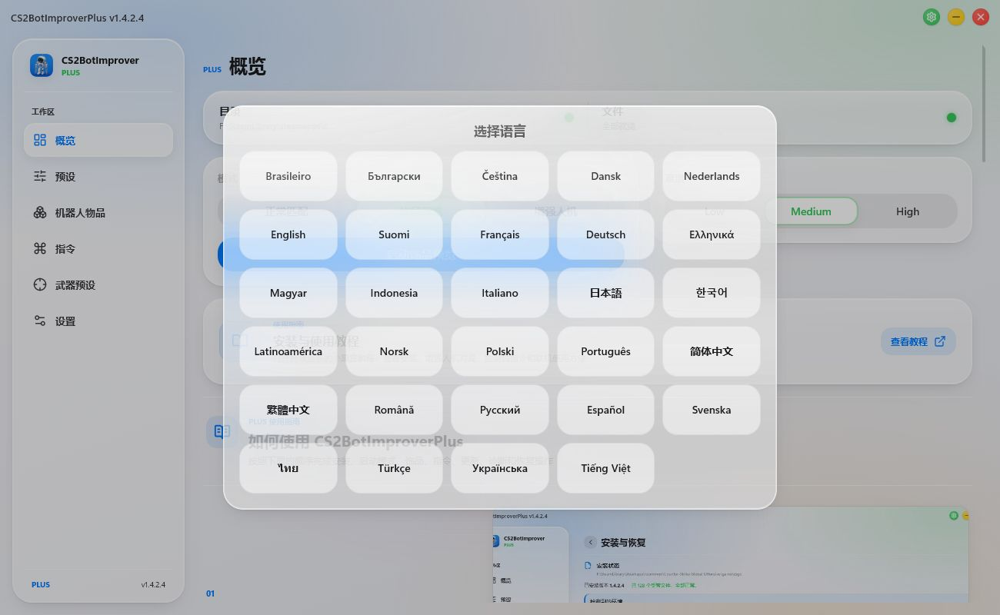

### 2. 确认 `game/csgo` 游戏目录

面板会搜索 Steam 注册表、所有 `libraryfolders.vdf` 和 CS2 应用清单

- 只找到一个有效安装时会自动选择
- 找到多个安装时必须选择实际通过 Steam 启动的那一份
- 只有自动检测失败时才需要点击浏览并手动选择
- 不要选择 CS2 根目录、`game`、`bin` 或面板所在目录

  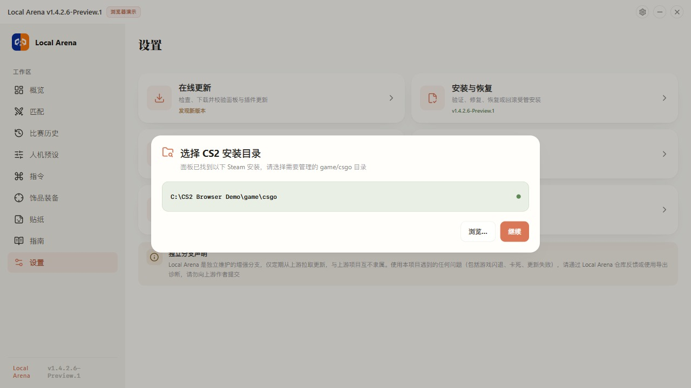

### 3. 检查安装预览

修改文件前，面板会先识别当前游戏环境

| 检测到的环境 | 面板执行的操作 | 保留的数据 |
| --- | --- | --- |
| 纯净 CS2 | 安装 Local Arena | 覆盖前备份原有文件 |
| 已纳管 Local Arena | 更新或修复 Local Arena | 保留首次原始备份和玩家预设 |
| 旧版安装 | 一键接管并更新 | 保留现有饰品和迁移前文件 |
| 上游原版插件 | 一键替换为 Local Arena | 先备份当前上游安装 |
| 混合或未知插件 | 禁止自动安装 | 先导出诊断或恢复纯净 CS2 |

  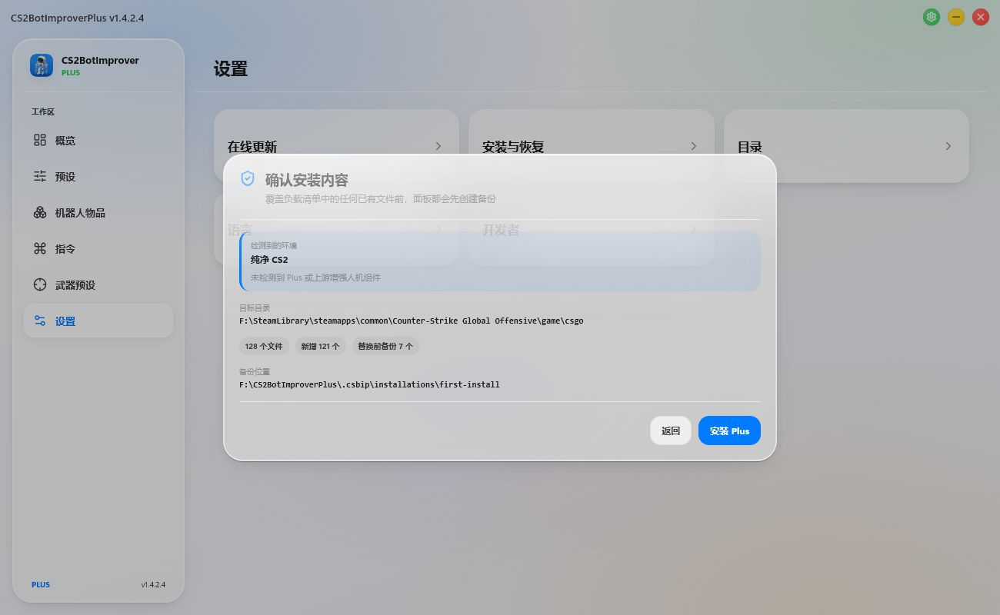

### 4. 完成安装并进入面板

安装过程使用事务日志，复制后会逐个验证文件，任何步骤失败都会尝试回滚已完成的操作

安装过程中不要启动 CS2、关闭面板或连续重复点击安装按钮

  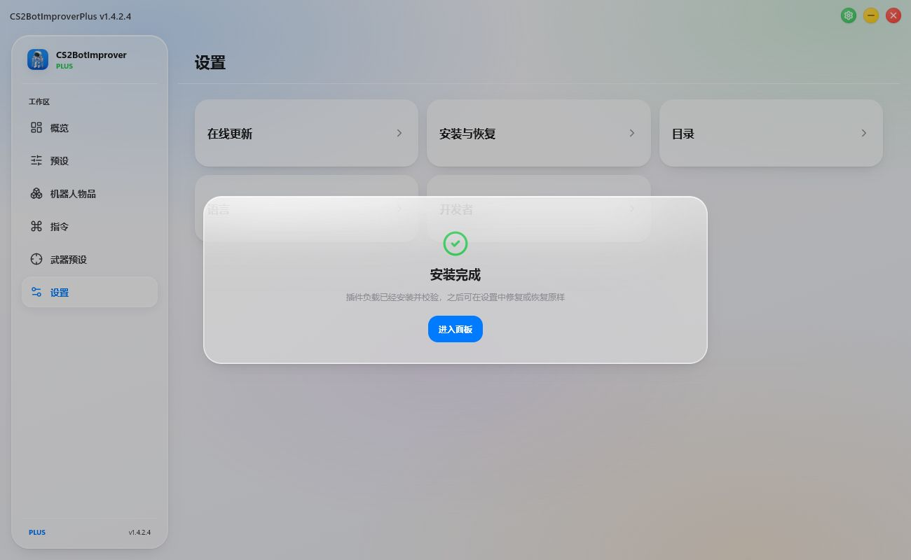

## 更新已有安装

可以使用时优先选择**设置 → 在线更新**

手动更新压缩包时，先关闭 CS2 和旧面板，把新包解压到原来的便携面板目录，并保留隐藏的 `.csbip` 文件夹

如果必须更换面板目录，需要先把旧目录中的完整 `.csbip` 文件夹复制到新面板旁边，再打开新面板，这样原始备份、安装登记、玩家预设和日志才不会断开

安装器可以区分已经纳管的 Local Arena、旧版安装、上游原版增强人机插件和不完整的混合环境

玩家饰品 JSON、当前难度和受支持的人机选项不会被当成负载损坏文件

  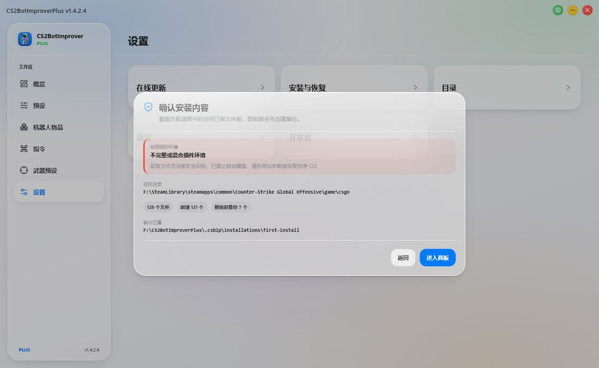

如果环境被识别为混合或未知插件，不要继续手动覆盖

先导出诊断，再使用**恢复纯净 CS2**清理能够确认的增强插件文件，完成 Steam 文件验证后重新进行纯净首次安装

## 选择正确的启动模式

| 模式 | 启用的内容 | 官方匹配 |
| --- | --- | :---: |
| 正常匹配 | 关闭增强插件加载 | 可以进入 |
| 饰品预览 | 只启用玩家饰品，保留官方普通人机 | 禁止进入 |
| 增强人机 | 启用完整上游人机系统和玩家饰品 | 禁止进入 |

每次启动 CS2 前，先在概览页面选择需要的模式，再通过面板启动游戏

### 正常匹配

用于普通在线游戏

面板会移除受管的 MetaMod 搜索路径，并且不会添加 `-insecure`

### 饰品预览

只需要查看玩家刀具、手套、枪皮和音乐盒时使用

增强人机 AI、难度、购买、档案、探员和行为系统全部关闭，官方普通人机仍然可以正常使用

### 增强人机

用于完整的 Local Arena 体验

该模式会启用全部同步的上游人机功能、当前难度、人机物品、控制台指令和玩家饰品

## 玩家饰品预设

### CT 与 T 武器

武器预设页面按照 CT 专属、T 专属和双方共用武器分类

- CT 与 T 专属武器分别保存，不会互相覆盖
- 双方共用武器默认联动同一个皮肤
- 关闭“CT/T 使用同一皮肤”后可以分别设置两边
- 重新启用联动时，以当前正在编辑的阵营覆盖另一边
- 只有兼容的目录条目才会显示 StatTrak 或纪念品选项
- StatTrak 数值会写回对应阵营预设

  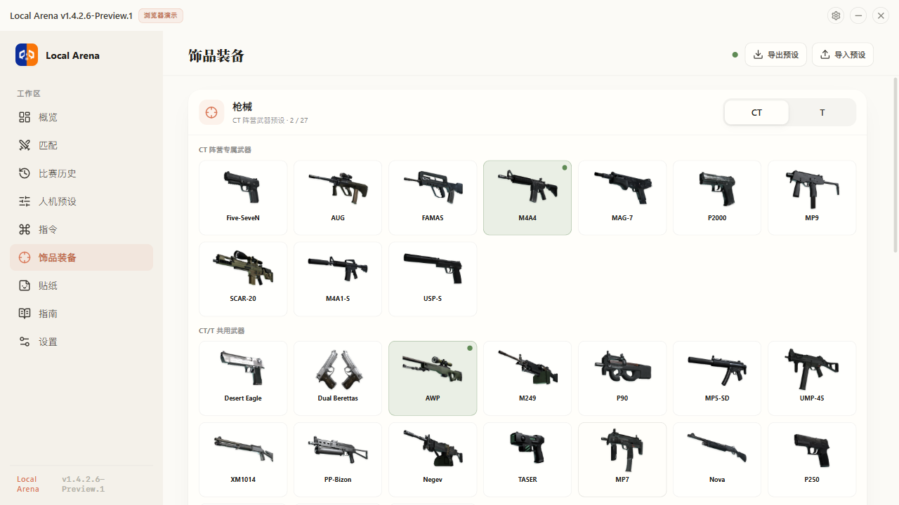

### CT 与 T 刀具和手套

刀具与手套弹窗共用当前 CT 或 T 阵营选择

两边可以分别保存型号、涂装、磨损、模板、名称标签、默认刀具和受支持的 StatTrak 数值

只保证玩家手中默认刀能够应用设置后的外观，不再为掉落到地面的刀即时渲染皮肤

### 人机预设

预设页面用于设置人机瞄准、投掷物行为、掉落刀具按键，以及玩家 CT 与 T 刀具手套入口

  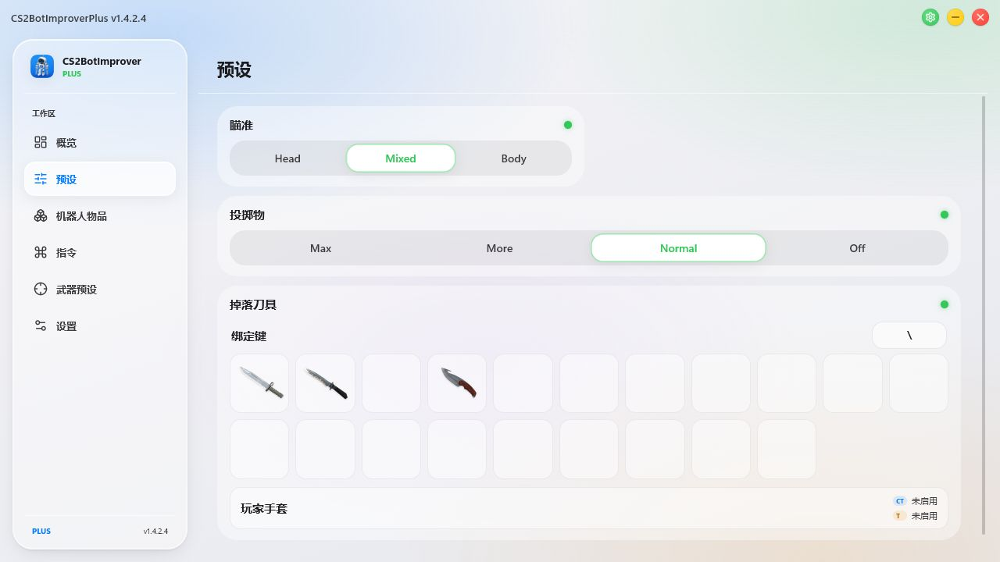

## 其他面板页面

### 人机物品

人机皮肤、档案、探员和音乐盒可以分别启用，不会覆盖真人玩家自己的 CT 与 T 预设

  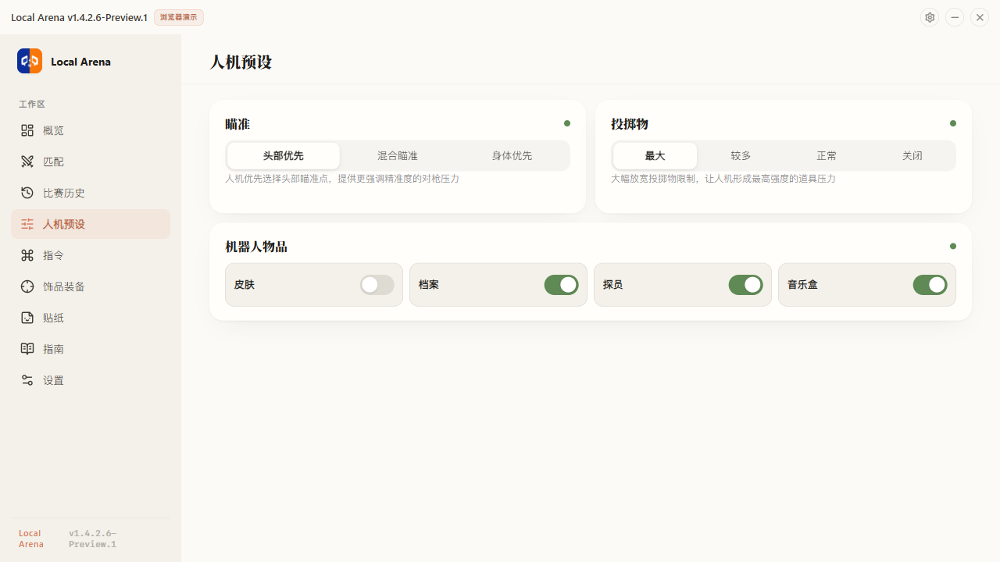

### 控制台指令

指令按照常用、人机、战队、协同购买和连接用途分类

选择分类或按照用途搜索，点击指令即可复制准确的控制台文字

  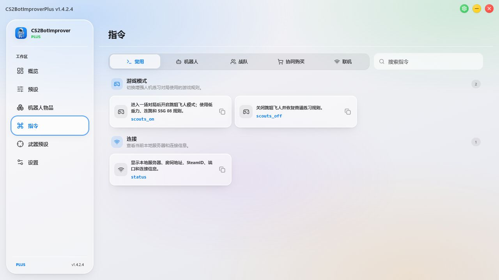

上游原始指令集合仍可在 [Commands.txt](https://github.com/ed0ard/CS2-Bot-Improver/blob/main/Commands.txt) 查看

## 安装、更新与恢复

### 安装健康状态

在**设置 → 安装与恢复**中可以查看检测到的环境、已安装版本、受管文件健康度、备份位置和可用操作

修改饰品、CT/T 预设、难度或受管人机选项不会被报告为负载损坏

  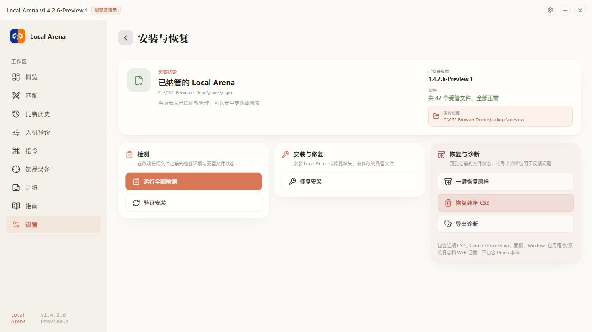
  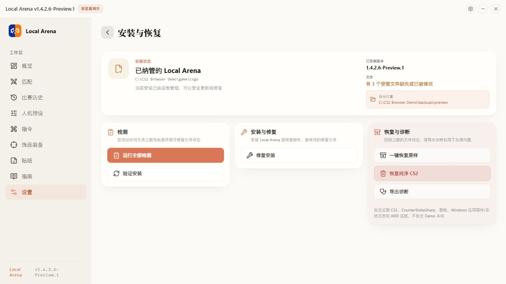

### 在线更新

面板和插件负载会分别检查和安装更新

- 启动检查不会阻塞面板，并且会缓存六小时
- 手动检查更新会绕过缓存
- 插件更新前必须关闭所选目录对应的 CS2
- 下载内容通过签名、大小和 SHA-256 验证后才会安装
- 玩家预设使用保留配置策略，不会被修复或更新覆盖

  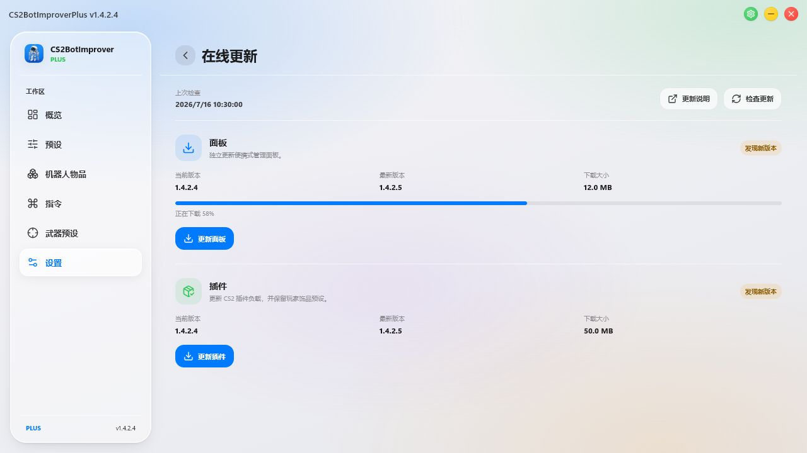

### 恢复操作的区别

| 操作 | 适用情况 | 结果 |
| --- | --- | --- |
| 验证安装 | 需要重新检查健康状态 | 只读检查所有受管文件 |
| 修复安装 | 受管文件确实缺失或损坏 | 只重新安装受影响的负载文件 |
| 一键恢复原样 | 需要撤销已经纳管的 Local Arena 安装 | 恢复安装时备份并删除 Local Arena 新建的文件 |
| 恢复纯净 CS2 | 需要删除 Local Arena 或上游增强插件 | 删除确认属于增强版的文件，保留未知第三方文件，然后提示 Steam 验证 |
| 导出诊断 | 问题可以复现或原因不明确 | 创建 ZIP 并自动打开所在文件夹 |

执行受管恢复前，玩家饰品预设会复制到便携式 `.csbip/presets` 目录

## 常见问题

### 目录和文件状态全部显示红色

面板没有找到有效的 `game/csgo` 目录，因此安装和启动按钮会保持不可用

打开**设置 → 目录**，选择直接包含 `gameinfo.gi` 和 `cfg` 的文件夹，然后刷新检查结果

  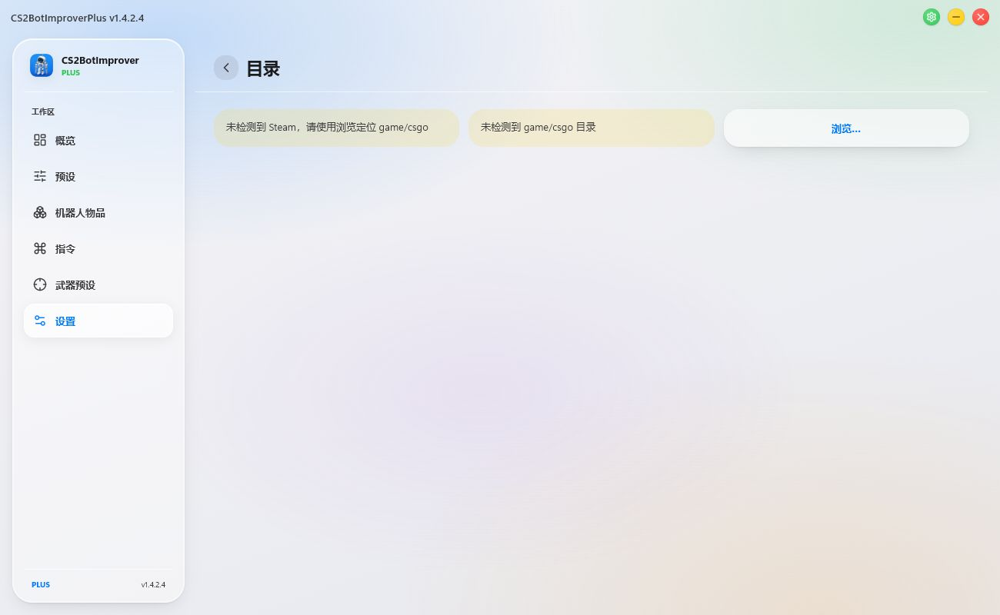

### 安装环境显示混合或未知插件

面板只找到部分 Local Arena 或上游插件，同时存在无法安全确认归属的文件

删除或覆盖任何内容前先导出诊断，使用**恢复纯净 CS2**删除能够确认的增强插件文件，完成 Steam 文件验证后重新进行纯净首次安装

### 按钮全部变灰或安装看起来卡住

所选 CS2 目录可能仍在运行，或者另一个安装事务仍然持有文件锁

完整退出 CS2，等待 `cs2.exe` 消失，保持面板开启，状态刷新后再重试

  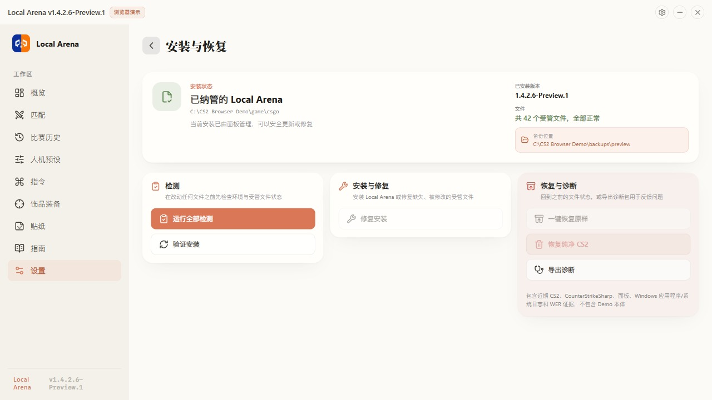

### 提示一个或多个受管文件被修改

先点击**验证安装**重新检查

只有受管负载文件确实缺失或损坏时才使用**修复安装**，修复期间必须关闭 CS2

玩家饰品预设、难度和受支持的人机选项会被保留，不应该计入损坏文件

### 在线更新无法连接或验证失败

网络、签名、大小、哈希、兼容性或回滚验证失败时，更新器会在安装前停止

保留当前版本，确认能够连接 GitHub 后手动重新检查，相同错误反复出现时导出诊断

  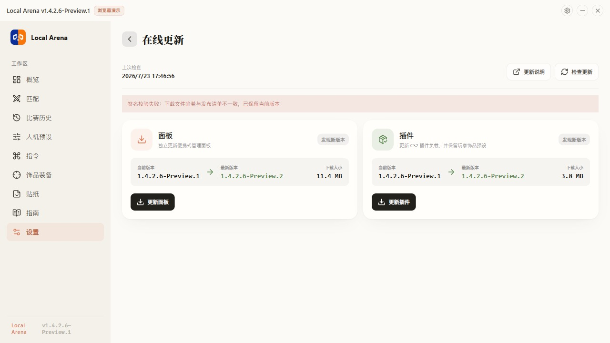

### 饰品没有显示

- 使用饰品预览或增强人机模式
- 确认当前 CT 或 T 的刀具、手套和武器预设已经启用
- 使用恢复功能前，先验证并修复受管安装
- 正常匹配模式会主动关闭 PlayerCosmetics

### 一键恢复原样后仍然不是纯净 CS2

**一键恢复原样**会回到受管安装记录中的安装前状态，而安装前状态本身可能已经包含旧版兼容安装或上游插件

需要删除所有能够确认的增强插件时，应使用**恢复纯净 CS2**，然后在启动游戏前完成 Steam 文件验证

### CS2 卡死或闪退

立即重新打开面板并点击**导出诊断**

提交 ZIP 时同时说明当前模式、地图、玩法、阵营和准确触发步骤

如果是在选边阶段闪退，还需要说明停留在选边页面多久后才选择 CT 或 T

## 上游代码来源与署名

Local Arena 分发部分基于 [ed0ard/CS2-Bot-Improver](https://github.com/ed0ard/CS2-Bot-Improver) AGPL-3.0 代码的增强人机组件，包括

1. 更强且更接近真人的瞄准方式
2. 根据局势使用投掷物
3. 改进人机移动并减少卡住
4. 扩展武器购买和经济管理
5. 压枪扫射、甩枪、穿烟射击和背闪行为
6. 人机刀具、手套、武器皮肤、探员、音乐盒、头像和档案
7. 更有组织且更警觉的人机决策
8. 基于 HLTV 数据的职业选手和随机玩家名称
9. 更适合人机对局的游戏规则
10. 扩展控制台指令和职业战队阵容

上游项目是 Local Arena 的代码来源和署名对象，不是 Local Arena 的支持渠道。需要查看其原始实现、Linux 安装说明和文档时，请访问 [ed0ard/CS2-Bot-Improver](https://github.com/ed0ard/CS2-Bot-Improver)

## 致谢

- [ed0ard/CS2-Bot-Improver](https://github.com/ed0ard/CS2-Bot-Improver)
- [Metamod:Source](https://github.com/alliedmodders/metamod-source)
- [CounterStrikeSharp](https://github.com/roflmuffin/CounterStrikeSharp)
- [Ray-Trace](https://github.com/FUNPLAY-pro-CS2/Ray-Trace)
- [CS2-Bot-Randomizer](https://github.com/ed0ard/CS2-Bot-Randomizer)
- [CS2-Bot-Hider](https://github.com/XBribo/CS2-Bot-Hider)
- [CS2-Bot-Controller](https://github.com/XBribo/CS2-Bot-Controller)
- [CS2-BotAI](https://github.com/ed0ard/CS2-BotAI)
- [CS2-Bot-Buy](https://github.com/ed0ard/CS2-Bot-Buy)
- [CS2-Bot-NadeSystem](https://github.com/ed0ard/CS2-Bot-NadeSystem)
- [RoundDamageRecap](https://github.com/YuGeYu/LBTV-CS2-Bot-Enhancer/tree/main/addons/counterstrikesharp/plugins/RoundDamageRecap)

## 许可证

[AGPL-3.0](LICENSE)

---

[返回顶部](#local-arena)

